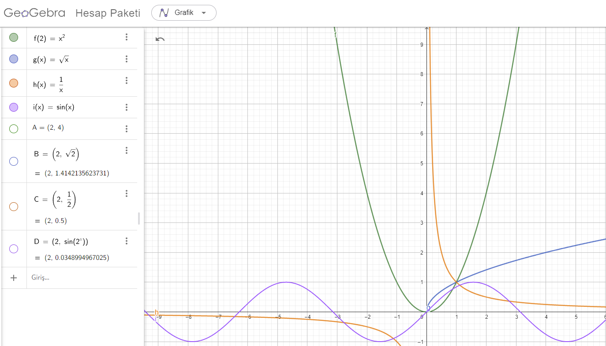
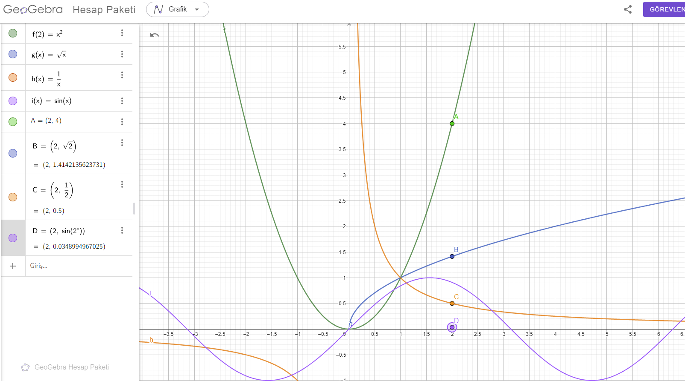
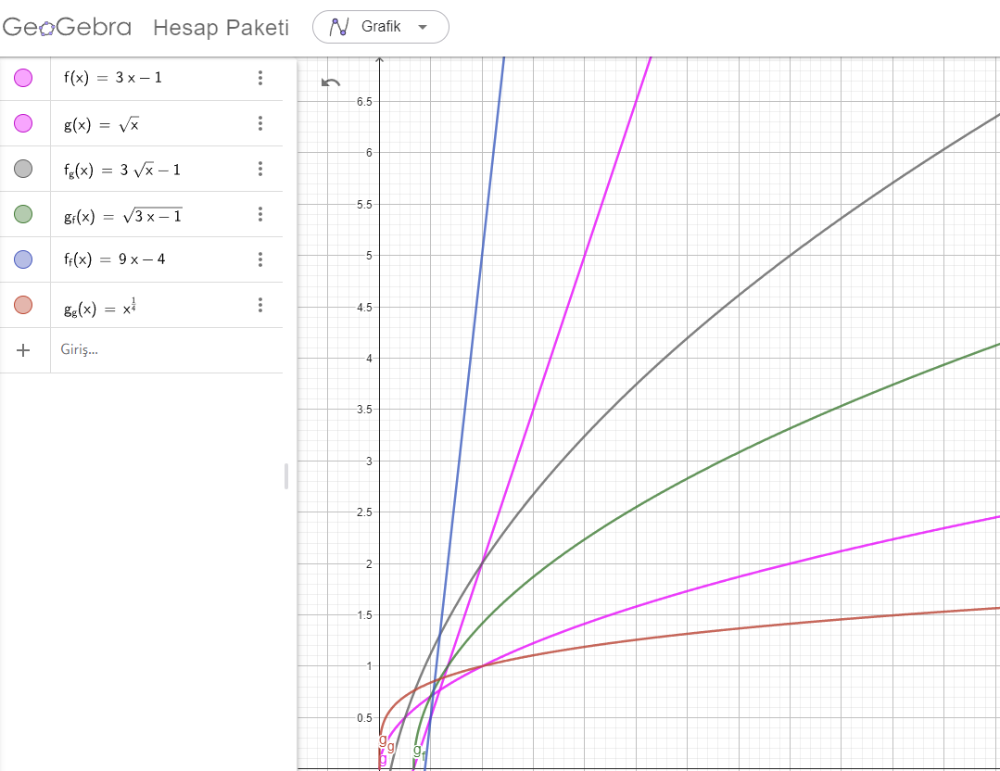
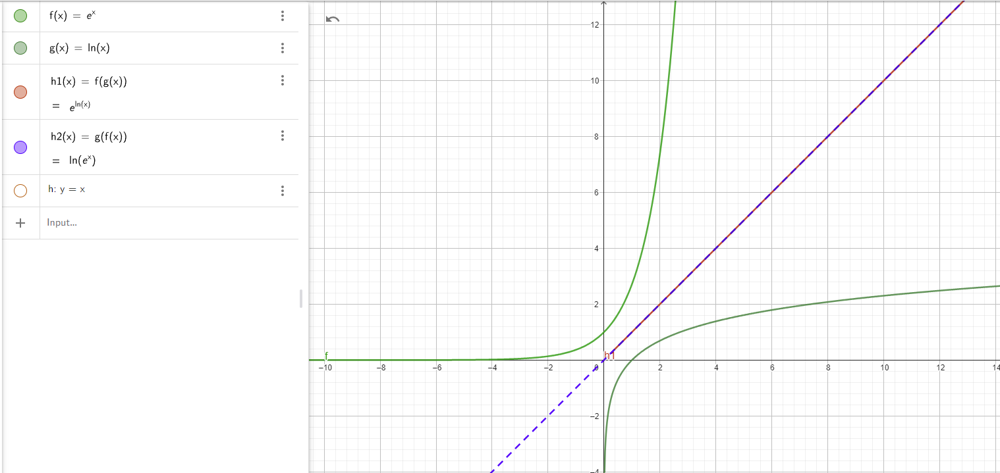
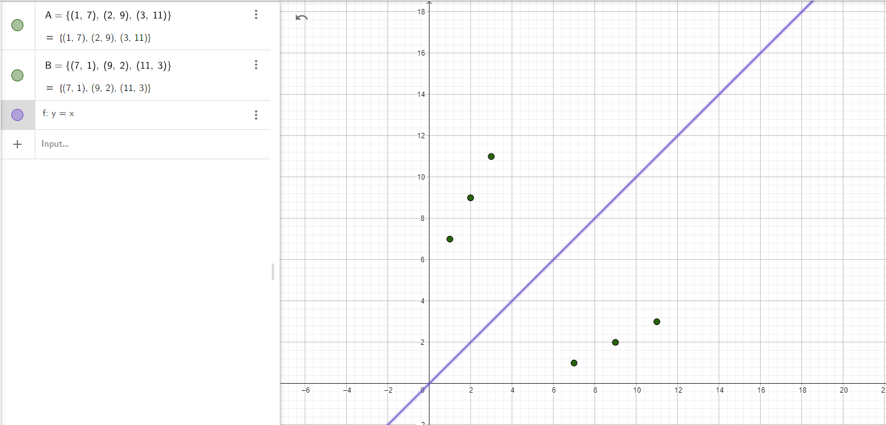
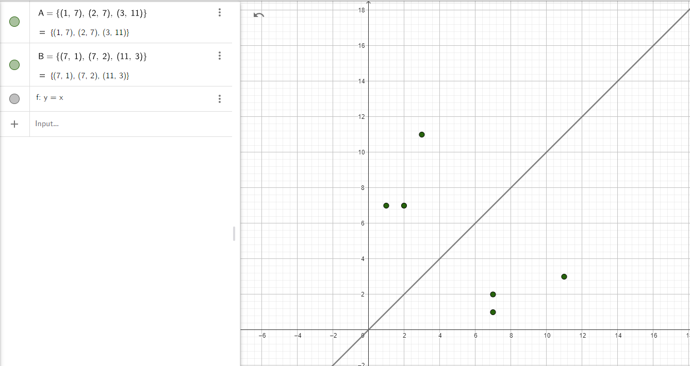
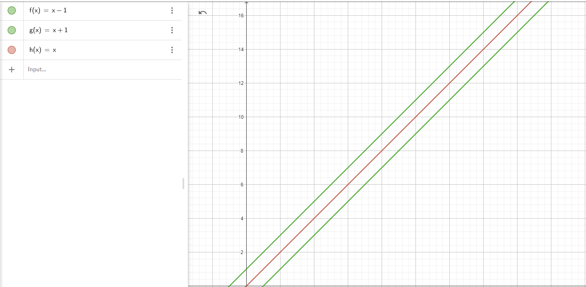

# Mathematics

Exercises 2024/2025

## 1. Basic Operations on Matrices

For follwing matrices 

$$
\mathbf{A}=
\begin{pmatrix}
1 & 2 \\
3 & 4 
\end{pmatrix}
\qquad
\mathbf{B}=
\begin{pmatrix}
5 & 6 \\
7 & 8
\end{pmatrix}
\quad
\mathbf{C}=
\begin{pmatrix}
-1 & 2 \\
3 & 0
\end{pmatrix}
\qquad
\mathbf{D}=
\begin{pmatrix}
-1 & 2 & 3 \\
4 & 0 & 6 
\end{pmatrix}
\qquad
\mathbf{E}=
\begin{pmatrix}
1 & 2\\
4 & 5\\
7 & 8
\end{pmatrix}
$$

1. Calculate: $\mathbf{A}+\mathbf{B}$;  $\mathbf{B}-\mathbf{A}$;  $\mathbf{A}+\mathbf{C}$; $\mathbf{D}+\mathbf{E}$. 

2. Calculate $\frac{1}{2}\mathbf{A}$, $2\mathbf{B}$, $-3\mathbf{C}$, and $4\mathbf{D}$.

3. Calculate the products $\mathbf{A}\cdot \mathbf{B}$; $\mathbf{B} \cdot \mathbf{A}$; $\mathbf{A} \cdot \mathbf{D}$; $\mathbf{D} \cdot \mathbf{E}$.

## 2. Determinants 2x2 and 3x3

Calculate the determinants for the 2x2 and 3x3 matrices given below.

2x2 Matrices:

$$
\mathbf{A} =
\begin{pmatrix}
2 & 3 \\
1 & 4
\end{pmatrix}
, \qquad
\mathbf{B} =
\begin{pmatrix}
5 & 6 \\
7 & 8
\end{pmatrix}
, \qquad
\mathbf{C} =
\begin{pmatrix}
-1 & 2 \\
3 & 0
\end{pmatrix}
$$

3x3 Matrices:

$$
\mathbf{D} =
\begin{pmatrix}
1 & 0 & 2 \\
-1 & 3 & 1 \\
2 & 4 & -2
\end{pmatrix}
, \qquad
\mathbf{E} =
\begin{pmatrix}
3 & 1 & -1 \\
0 & 2 & 4 \\
5 & 3 & 2
\end{pmatrix}
, \qquad
\mathbf{F} =
\begin{pmatrix}
2 & -3 & 1 \\
1 & 4 & -2 \\
1 & 5 & 3
\end{pmatrix}
$$

## 3. Determinants using Laplace's Expansion

Calculate the determinants of the following matrices:

$$
\mathbf{A} =
\begin{pmatrix}
2 & 3 & 1 \\
1 & 4 & 0 \\
3 & 2 & 1
\end{pmatrix}
,\qquad
\mathbf{B} =
\begin{pmatrix}
2 & 3 & 1 \\
1 & 4 & 0 \\
3 & 2 & 0  \\
\end{pmatrix}
,\qquad
\mathbf{C} =
\begin{pmatrix}
2 & 3 & 1 & 4 \\
1 & 0 & 0 & 6 \\
3 & 2 & 1 & 5 \\
2 & 1 & 4 & 0
\end{pmatrix}
,\qquad
\mathbf{D} =
\begin{pmatrix}
2 & 3 & 1 & 4 & 5 \\
1 & 4 & 0 & 0 & 7 \\
3 & 0 & 0 & 0 & 0 \\
2 & 1 & 4 & 3 & 2 \\
1 & 2 & 3 & 4 & 5
\end{pmatrix}
$$

## 4. Determinants from the Gauss Method and Triangular Matrices

Perform row and column operations to reduce the following matrices to an upper triangular form and calculate their determinants by taking the product of the diagonal elements.

$$
\mathbf{A} = \begin{pmatrix}
12 & 3 \\
-18 & -4
\end{pmatrix}\qquad\qquad
\mathbf{B} = \begin{pmatrix} 
1 & 2 & 3 \\
4 & 5 & 6 \\
7 & 8 & 9 
\end{pmatrix}
$$

## 5. Inverse of a Matrix from the formula

1. Find the inverse matrix for matrix 

$$\mathbf{A}=\begin{pmatrix}
2 & 0 & 1 \\
0 & 1 & 0 \\
1 & 2 & 0
\end{pmatrix}$$

and verify if the result is correct.

2. Determine the rank of the matrix:

$$\mathbf{B} =
\begin{pmatrix}
4 & -3 & 7 \\
-1 & 6 & 3 \\
2 & 9 & 1
\end{pmatrix}$$

## 6. Inverse of a Matrix using the Gauss Method

Find the inverse matrices using the Gauss method:

$$
\mathbf{A} =
\begin{pmatrix}
1 & 2\\
3 & 4
\end{pmatrix}
, \qquad
\mathbf{B} =
\begin{pmatrix}
1 & 2 & 3 \\
4 & 5 & 1 \\
2 & 3 & 2
\end{pmatrix}
,\qquad
\mathbf{C} =
\begin{pmatrix}
0 & 0 & 1\\
0 & 1 & 0\\
1 & 0 & 0
\end{pmatrix}
$$

## 7. Linear Equations old school

Solve the following systems of equations without using matrices:

* $3x-2y=5, \quad 2x+3y=7$,
* $2x-3y=10, \quad 4x+5y=20$,
* $2x - y + z = 3, \quad x + 2y - z = 1, \quad 3x - y + 2z = 11$.
* $2x-3y+4z+2t=2, \quad 3x+2y-5z+3t=3, \quad 4x-3y+2z-5t=4, \quad 5x+4y-3z+2t=5$.

## 8. Linear equations by Cramer's Rule

1. Solve the system of equations:

$$\begin{cases}
   2x_1 - 3x_2 = 7\\
   3x_1 + 5x_2 = 2
\end{cases}$$

2. Solve the system of equations:

$$\begin{cases}
   2x + y - z = 1 \\
   x - y + 2z = 4 \\
   3x - 2z = -1
\end{cases}$$

3. Solve the system of equations:

$$\begin{cases}
   x + y + z - t = 2 \\
   x - z + 2t = 6 \\
   2x - 3y + t = 4 \\
   3x + y + 3z - 4t = -2
\end{cases}$$

4. Why can't the following system of equations be solved using Cramer's rule?

$$\begin{cases}
x_1 + 2x_2 + 3x_3 = 3 \\
4x_1 + 5x_2 + 6x_3 = 2 \\
7x_1 + 8x_2 + 9x_3 = 1
\end{cases}$$

## 9. Linear equations by Gauss Elimination

$$\begin{cases}
x + 2y - 2z = 4 \\
2x + y + z = 0 \\
3x + 2y + z = 1
\end{cases}
\quad
\begin{cases}
x + y + z - t = 2 \\
2x + y + z = 3 \\
-x + z - t = 0 \\
3x + 2y - z + 2t = -1
\end{cases}
\quad
\begin{cases}
x + y - z - t = 0 \\
2x + 3y - 2z + t = 4 \\
3x + 5z = 0 \\
-x + y - 3z + 2t = 3
\end{cases}
$$

## 10. Linear equations by Matrix Inversion

1. Solve the system of linear equations using the inverse matrix method:

$$
\begin{cases}
x + 2y + 3z = 5, \\
2y + 3z = 4, \\
3z = 3.
\end{cases}
$$

2. Solve the system of linear equations using the inverse matrix method:

$$
\begin{cases}
x_1 + 2x_2 + 3x_3 = 41, \\
4x_1 + 5x_2 + 6x_3 = 93, \\
7x_1 + 8x_2 + 9x_3 = 145.
\end{cases}
$$

## 11. Vectors I

1. By what number should vector $\mathbf{a} = [3, 4]$ be multiplied so that its length is equal to 1?

2. Calculate the length of vector $\mathbf{b} = [1, 1]$ and find the unit vector of this vector.

3. Plot the vector and the unit vector from the previous exercise.

4. Calculate the length of vector $\mathbf{c} = [1, 2, 3]$ and find the unit vector of this vector.

5. Find the Cartesian coordinates of vector $\mathbf{v} = [2, 3, 4]$ in the basis $\{\mathbf{b_1} = [1, 0, 1], \mathbf{b_2} = [0, 1, 0], \mathbf{b_3} = [1, 0, -1]\}$.

## 12. Vectors II

1. Perform the addition of vector $[2, 1]$ to vector $[-1, 1]$. Plot both vectors and their sum on a graph.

2. Calculate the area of the triangle spanned by vectors $[2, 1, 2]$ and $[-1, 1,1]$.

3. Calculate the volume of the parallelepiped spanned by vectors $[2, 1, -1]$, $[-1, 1, 0]$, and $[1, 2, 1]$.

4. Check if vectors $[2, 1]$ and $[-1, 1]$ are perpendicular.

5. Calculate the angle in degrees between vectors $[4,2,1]$ and $[1,3,2]$.

6. For three-dimensional vectors: $\mathbf{a}=[a_x, a_y, a_z]$, $\mathbf{b}=[b_x, b_y, b_z]$, $\mathbf{c}=[c_x, c_y, c_z]$, prove that the following identity is satisfied:

$$
\mathbf{a} \times (\mathbf{b} \times \mathbf{c}) = (\mathbf{a} \cdot \mathbf{c}) \mathbf{b} - (\mathbf{a} \cdot \mathbf{b}) \mathbf{c}.
$$

## 13. Vectors III

1. Divide the line segment connecting points $A(-1, 2)$ and $B(3, -2)$ in the ratio $1:3$. Illustrate the result on a graph.

2. Project vector $\mathbf{a} = (3, 4)$ onto the $OX$ and $OY$ axes. Illustrate the result on a graph.

3. Project vector $\mathbf{a} = (2,3)$ onto vector $\mathbf{b} = (1, 1)$. Ilustrate the result on a graph.

4. Project vector $\mathbf{b} = (1, 1)$ onto vector $\mathbf{a} = (2, 3)$. Ilustrate the result on a graph.

## 14. Equations of lines on a plane

* The line passes through points $A(1, 2)$ and $B(3, 4)$. Find the equation of the line.
* The line passes through point $A(1, 2)$ and is parallel to the line $y = 2x + 3$. Find the equation of the line.
* The line passes through point $A(1, 2)$ and is perpendicular to the line $y = 2x + 3$. Find the equation of the line.
* We have two lines $y = 2x + 3$ and $y = 3x + 2$. Find the intersection point of these lines and calculate the angle between them.
* Write the equation of the line passing through point $A(1, 2)$ and parallel to the vector $\mathbf{v} = [2, 3]$.
* We have the line $y = 2x + 3$. Find an example of a line perpendicular and parallel to it.
* We have the line $y = 2x + 3$ and point $A(1, 2)$. Find the distance from point $A$ to the line.
* The line intersects the coordinate axes at points $A(2, 0)$ and $B(0, 3)$. Find the equation of the line.
* Calculate the angle between the line $y = x + 3$ and the $Ox$ axis.
* Provide a vector perpendicular to the line $x + y + 1 = 0$.

## 15. Equations of second-order curves (conic sections)

* Find the equation of a circle with center at point $A(1,2)$ and radius $r=3$.
* Find the equation of a parabola intersecting the $Ox$ axis at points $x=2$, $x=4$, and passing through point $y(3)=1$.
* Find the center of the ellipse with the equation $x^2 + 4y^2 - 4x - 16y + 16 = 0$.
* Find the slope ($m>0$) of the line $y=mx-5$ that is tangent to the circle with the equation $x^2 + y^2=1$.
* Find the intersection points of the hyperbola $x^2 - y^2 = 1$ with the ellipse's line $x^2 + 4y^2 = 6$.
* For the given hyperbola $x^2 - y^2 = 1$, find the distance between its branches.

## 16. Equations of planes in space

* The plane passes through points $A(1, 2, 3)$, $B(3, 4, 5)$, and $C(2, 1, 4)$. Find the equation of the plane.
* The plane passes through point $A(1, 2, 3)$ and is parallel to the plane $2x + 3y + 4z = 5$. Find the equation of the plane.
* The plane passes through point $A(1, 2, 3)$ and is perpendicular to the normal vector $\mathbf{n} = [2, 3, 4]$. Find the equation of the plane.
* We have two planes $2x + 3y + 4z = 5$ and $3x + 4y + 2z = 6$. Find the line of intersection of these planes.
* Write the equation of the plane passing through point $A(1, 2, 3)$ and parallel to vectors $\vec{v_1} = [1, 0, 1]$ and $\vec{v_2} = [0, 1, -1]$.
* We have the plane $2x + 3y + 4z = 5$. Find an example of a plane parallel and perpendicular to it.
* We have the plane $2x + 3y + 4z = 5$ and point $A(1, 2, 3)$. Find the distance from point $A$ to this plane.
* The plane intersects the coordinate axes at points $A(2, 0, 0)$, $B(0, 3, 0)$, and $C(0, 0, 4)$. Find the equation of the plane.
* Calculate the angle between the plane $x + y + z = 1$ and the plane $x = 0$ (i.e., the $yz$ plane).
* Find the vector perpendicular to the plane $x + y + z = 1$.

## 17. Equations of second-order surfaces

* Write the equation of a sphere with center at point $P=(1,2,3)$ and radius $r=3$.
* Do the spheres with equations $x^2 + y^2 + z^2 = 1$ and $x^2 + y^2 + z^2 = 2$ have any common points?
* What curve in space is formed by the intersection of the sphere $x^2 + y^2 + z^2 = 1$ with the sphere $(x-1)^2 + y^2 + z^2 = 1$? Find the equation of this curve.
* Write the equation of the tangent plane to the paraboloid $z=(x-1)^2+y^2+1$ at point $P(1,0,1)$.

## 18. Functions

1. Draw in a single Geogebra notebook the following functions:
   - $f(x) = x^2$
   - $g(x) = \sqrt{x}$
   - $h(x) = \frac{1}{x}$
   - $j(x) = \sin(x)$

### **Step 1: Find values of all the above functions at $x = 2$**
- $f(2) = 2^2 = 4$
- $g(2) = \sqrt{2} \approx 1.41$
- $h(2) = \frac{1}{2} = 0.5$
- $j(2) = \sin(2) \approx 0.909$

---

2. Let $f(x) = 3x - 1$ and $g(x) = \sqrt{x}$. Find:
   - $f(g(x)) = 3\sqrt{x} - 1$
   - $g(f(x)) = \sqrt{3x - 1}$
   - $f(f(x)) = 3(3x - 1) - 1 = 9x - 4$
   - $g(g(x)) = \sqrt{\sqrt{x}} = x^{1/4}$

and visualize functions in a single Geogebra notebook.

---

3. Let $f(x) = e^x$ and $g(x) = \ln(x)$. Check: $f(g(x))$ and $g(f(x))$. What do you notice?

### **Step 1: Compute $f(g(x))$**
We are given:
- $f(x) = e^x$
- $g(x) = \ln(x)$

Now, compute:

$$
 f(g(x)) = f(\ln(x)) = e^{\ln(x)}
$$
Since $e^{\ln(x)} = x$, we get:

$$
 f(g(x)) = x
$$

### **Step 2: Compute $g(f(x))$**
$$
 g(f(x)) = g(e^x) = \ln(e^x)
$$
Since $\ln(e^x) = x$, we get:

$$
 g(f(x)) = x
$$

### **Step 3: What Do You Notice?**
Since both compositions return $x$, these functions are inverses of each other. This means:

$$
 f(x) = e^x \quad \text{and} \quad g(x) = \ln(x) \quad \text{are inverse functions.}
$$

---
  

4. We have function $f=\{(1,7), (2,9), (3,11)\}$. **Find inverse function** $f^{-1}$:
   
   - $f^{-1} = \{(7,1), (9,2), (11,3)\}$.

5. We have function $f=\{(1,7), (2,7), (3,11)\}$. **Find inverse function** $f^{-1}$:
   
   - **This function does not have a proper inverse**, since $f$ is not one-to-one (two different inputs map to the same output).

6. We have function $f(x)= x-1$. **Find inverse function** $f^{-1}$:
   
   - Solve $y = x - 1 \Rightarrow x = y - 1 \Rightarrow y = x + 1$.
   - **So, $f^{-1}(x) = x + 1$.**
   - Show both functions on the same Geogebra notebook.

---

19  LIMITS  OF  SEQUENCES
 
1  Calculate:
 
$ \lim_{n \to \infty} \frac{n^2 + 3n}{2n^2 - 2n} $
 
Step 1: Divide both the numerator and the denominator by the highest power of n, which is n²:
 
$ \lim_{n \to \infty} \frac{1 + \frac{3}{n}}{2 - \frac{2}{n}} $
 
Step 2: As n approaches infinity, the terms  3/n and 2/n approach 0:
 
$ \lim_{n \to \infty} \frac{1 + 0}{2 - 0} = \frac{1}{2} $
 
Therefore, the limit is 1/2.
 
2. Calculate:
 
$ \lim_{n \to \infty} \frac{(2n + 3)^3}{n^3 - 1} $
 
Step 1: Expand the numerator:
 
$ \lim_{n \to \infty} \frac{8n^3 + 36n^2 + 54n + 27}{n^3 - 1} $
 
Step 2: Divide both the numerator and the denominator by n³:
 
$ \lim_{n \to \infty} \frac{8 + \frac{36}{n} + \frac{54}{n^2} + \frac{27}{n^3}}{1 - \frac{1}{n^3}} $
 
Step 3: As n approaches infinity, the terms with n in the denominator approach 0:
 
$ \lim_{n \to \infty} \frac{8 + 0 + 0 + 0}{1 - 0} = 8 $
 
Therefore, the limit is 8.
 
 ## 3. Prove using the squeeze theorem:
 
$ \lim_{n \to \infty} \frac{\sin(n)}{n} $
 
Step 1: We know that -1 ≤ sin(n) ≤ 1 for all n.
 
Step 2: Divide by n (n is always positive for n→∞):
 
$ \frac{-1}{n} \le \frac{\sin(n)}{n} \le \frac{1}{n} $
 
Step 3: As n approaches infinity, both -1/n and 1/n approach 0.
 
$ \lim_{n \to \infty} \frac{-1}{n} = 0 \quad \text{and} \quad \lim_{n \to \infty} \frac{1}{n} = 0 $
 
Step 4: By the squeeze theorem, since both the lower and upper bounds converge to 0, the limit of the sequence is 0.
 
## 4. Find the limit of the sequence:
 
$$ a_n = \left(1 + \frac{1}{n}\right)^n $$
 
This is the definition of the Euler's number, e.
 
$ \lim_{n \to \infty} a_n = e $
 
Therefore, the limit of the sequence is e (approximately 2.71828).
 
 
 
## 20 LIMITS OF REAL FUNCTIONS  $$ \lim_{x \to \infty} \frac{x^3 + 2x^2}{x^4 - 3x^3} $$
 
Step 1: Identify the highest power of x in the numerator and denominator.
 
The highest power of x in the numerator is x³ and in the denominator is x⁴.
 
Step 2: Divide both the numerator and denominator by the highest power of x in the denominator (x⁴).
 
$$ \lim_{x \to \infty} \frac{\frac{x^3}{x^4} + \frac{2x^2}{x^4}}{\frac{x^4}{x^4} - \frac{3x^3}{x^4}} = \lim_{x \to \infty} \frac{\frac{1}{x} + \frac{2}{x^2}}{1 - \frac{3}{x}} $$
 
Step 3: Evaluate the limit as x approaches infinity.
 
As x approaches infinity, the terms $\frac{1}{x}$ and $\frac{2}{x^2}$
 and $\frac{3}{x}$ approach 0.
 
$$ \lim_{x \to \infty} \frac{\frac{1}{x} + \frac{2}{x^2}}{1 - \frac{3}{x}} = \frac{0 + 0}{1 - 0} = \frac{0}{1} = 0 $$
 
Therefore, the limit is 0.
 
2. $$ \lim_{x \to 0} \frac{\sin(3x)}{2x + 1} $$
 
Step 1:  Consider the limit of the numerator and denominator separately.
 
As x approaches 0, sin(3x) approaches sin(0) = 0.
As x approaches 0, 2x + 1 approaches 2(0) + 1 = 1.
 
Step 2: Evaluate the limit.
 
Since the numerator approaches 0 and the denominator approaches 1, the limit is:
 
$$ \lim_{x \to 0} \frac{\sin(3x)}{2x + 1} = \frac{0}{1} = 0 $$
 
Therefore, the limit is 0.
 
3. Asymptotes of $$ f(x) = \frac{x^2 - 1}{x^2 + 1} $$
 
Step 1: Check for vertical asymptotes.  Vertical asymptotes occur where the denominator is zero and the numerator is non-zero.  In this case, x² + 1 is never zero for real x, so there are no vertical asymptotes.
 
Step 2: Check for horizontal asymptotes.  Horizontal asymptotes are found by examining the limit as x approaches positive and negative infinity.
 
$$ \lim_{x \to \infty} \frac{x^2 - 1}{x^2 + 1} = \lim_{x \to \infty} \frac{1 - \frac{1}{x^2}}{1 + \frac{1}{x^2}} = \frac{1 - 0}{1 + 0} = 1 $$
 
$$ \lim_{x \to -\infty} \frac{x^2 - 1}{x^2 + 1} = \lim_{x \to -\infty} \frac{1 - \frac{1}{x^2}}{1 + \frac{1}{x^2}} = \frac{1 - 0}{1 + 0} = 1 $$
 
Therefore, there is a horizontal asymptote at y = 1.
 
Conclusion: The function $$ f(x) = \frac{x^2 - 1}{x^2 + 1} $$ has a horizontal asymptote at y = 1 and no vertical asymptotes.
 
4. Asymptotes of  $$ g(x) = \frac{\sin(x)}{x^2 + 1} $$
 
Step 1: Check for vertical asymptotes. The denominator x² + 1 is never zero, so there are no vertical asymptotes.
 
Step 2: Check for horizontal asymptotes.
 
$$ \lim_{x \to \infty} \frac{\sin(x)}{x^2 + 1} = 0 $$
 
$$ \lim_{x \to -\infty} \frac{\sin(x)}{x^2 + 1} = 0 $$
 
The sine function oscillates between -1 and 1, but the denominator grows without bound, causing the overall fraction to approach 0.
 
Conclusion: The function $$ g(x) = \frac{\sin(x)}{x^2 + 1} $$ has a horizontal asymptote at y = 0 and no vertical asymptotes.
 
 
 
21. DERIVATIVES
 
1. $$y(x) = -3x + 3$$
 
The derivative of a constant is 0, and the derivative of $$ax$$ is $$a$$. Therefore:
 
$$y'(x) = -3$$
 
2. $$y(x) = πx + sin(1)$$
 
The derivative of $$πx$$ is $$π$$, and the derivative of a constant (sin(1)) is 0.  Therefore:
 
$$y'(x) = π$$
 
3. $$y(x) = 4 + sin(2)$$
 
This is a constant function, so its derivative is 0:
 
$$y'(x) = 0$$
 
4. $$y(x) = 2x^3 - 3x^2 + 8x - 9$$
 
Using the power rule (the derivative of $$ax^n$$ is $$nax^{n-1}$$) :
 
$$y'(x) = 6x^2 - 6x + 8$$
 
5. $$y(x) = 6x^{1/3}$$
 
Using the power rule:
 
$$y'(x) = 6 * (1/3)x^{-2/3} = 2x^{-2/3} = \frac{2}{x^{2/3}}$$
 
6. $$y(x) = x$$
 
The derivative of x is 1:
 
$$y'(x) = 1$$
 
7. $$y(x) = cos(x) + sin(x)$$
 
The derivative of cos(x) is -sin(x), and the derivative of sin(x) is cos(x):
 
$$y'(x) = -sin(x) + cos(x)$$
 
8. $$y(x) = 2sin(x)cos(x)$$
 
This can be rewritten as $$y(x) = sin(2x)$$ using the double angle formula.  The derivative is then:
 
$$y'(x) = 2cos(2x)$$
 
9. $$y(x) = xsin(x)$$
 
Using the product rule,  $$(uv)' = u'v + uv'$$ where $$u = x$$ and $$v = sin(x)$$:
 
$$y'(x) = 1sin(x) + xcos(x) = sin(x) + xcos(x)$$
 
10. $$y(x) = (x+1)(x+1) = (x+1)^2$$
 
Expanding and using the power rule:
 
$$y(x) = x^2 + 2x + 1$$
$$y'(x) = 2x + 2$$
 
11. $$y(x) = \frac{x}{x+1}$$
 
Using the quotient rule, $$\left(\frac{u}{v}\right)' = \frac{u'v - uv'}{v^2}$$, where $$u = x$$ and $$v = x+1$$:
 
$$y'(x) = \frac{1(x+1) - x(1)}{(x+1)^2} = \frac{1}{(x+1)^2}$$
 
12. $$y(x) = (x+1)exp(x)$$
 
Using the product rule, with $$u = x+1$$ and $$v = exp(x)$$:
 
$$y'(x) = 1*exp(x) + (x+1)*exp(x) = exp(x)(x+2)$$
 
13. $$y(x) = sin(x^2)$$
 
Using the chain rule:
 
$$y'(x) = cos(x^2) * 2x = 2xcos(x^2)$$
 
14. $$y(x) = exp(-2x)$$
 
Using the chain rule:
 
$$y'(x) = exp(-2x) * (-2) = -2exp(-2x)$$
 
15. $$y(x) = \frac{1}{sin(x+1)}$$
 
This is equivalent to $$y(x) = csc(x+1)$$.  The derivative of csc(u) is -csc(u)cot(u). Using the chain rule:
 
$$y'(x) = -csc(x+1)cot(x+1)$$
 
16. $$y(x) = \frac{1}{2x+1}$$
 
Using the chain rule and the power rule:
 
$$y'(x) = -\frac{2}{(2x+1)^2}$$
 
Proofs and Limits
 
1. Prove: $$\frac{d}{dx}(ln(sin(x))) = cot(x)$$
 
Using the chain rule:
 
$$\frac{d}{dx}(ln(sin(x))) = \frac{1}{sin(x)} * cos(x) = \frac{cos(x)}{sin(x)} = cot(x)$$
 
2. For $$f(x) = cos(x)$$, verify that $$f''(x) = -f(x)$$
 
$$f'(x) = -sin(x)$$
$$f''(x) = -cos(x) = -f(x)$$
 
Limits using L'Hopital's Rule:
 
1. $$\lim_{x \to 0} \frac{sin(x)}{x}$$
 
Since we have the indeterminate form 0/0, we can apply L'Hopital's rule:
 
$$\lim_{x \to 0} \frac{cos(x)}{1} = 1$$
 
2. $$\lim_{x \to ∞} \frac{ln(x)}{x}$$
 
This is of the indeterminate form ∞/∞. Applying L'Hopital's rule:
 
$$\lim_{x \to ∞} \frac{1/x}{1} = 0$$
 
3. $$\lim_{x \to ∞} \frac{exp(x)}{x}$$
 
This is of the indeterminate form ∞/∞. Applying L'Hopital's rule:
 
$$\lim_{x \to ∞} \frac{exp(x)}{1} = ∞$$
 
Physics Problem
 
$$x(t) = 3t^2 - 6t + 1$$
 
$$V(t) = x'(t) = 6t - 6$$
 
$$a(t) = V'(t) = x''(t) = 6$$
 
At $$t = 2$$:
 
$$V(2) = 6(2) - 6 = 6$$
 
$$a(2) = 6$$
 
Therefore, at t=2, the velocity is 6 and the acceleration is 6.  The units would depend on the units of x and t (e.g., m/s for velocity, m/s² for acceleration).
 

## 22. Extremum

### **1. Maximizing Profit**
The profit function is given by:

$$ P(u) = -2u^2 + 50u - 300 $$

To find the number of units that maximize profit, we differentiate:

$$ P'(u) = -4u + 50 $$

Setting $P'(u) = 0$:

$$ -4u + 50 = 0 $$
$$ u = 12.5 $$

Since $u$ represents units sold, the **maximum profit occurs at either $u = 12$ or $u = 13$**.

---

### **2. Maximizing the Area of a Rectangle**
We have **10 meters of string** to form a rectangle. The perimeter equation is:

$$ 2x + 2y = 10 \Rightarrow y = 5 - x $$

The area function:

$$ A = x(5 - x) $$

Differentiate:

$$ A'(x) = 5 - 2x $$

Setting $A'(x) = 0$:

$$ 5 - 2x = 0 \Rightarrow x = 2.5, \quad y = 5 - 2.5 = 2.5 $$

Thus, the **maximum area is achieved with dimensions** **$2.5m \times 2.5m$** (a square).

---

### **3. Finding Extremum of $f(x) = x^2 + 3x - 5$**
Differentiate:

$$ f'(x) = 2x + 3 $$

Setting $f'(x) = 0$:

$$ 2x + 3 = 0 \Rightarrow x = -1.5 $$

Since $f''(x) = 2 > 0$, this is a **minimum point at $x = -1.5$**.

---

### **4. Finding Extremum of $f(x) = \frac{x^2 + 2x + 1}{x - 1}$**
Rewrite numerator:

$$ f(x) = \frac{(x+1)^2}{x-1} $$

Differentiate using the **quotient rule**:

$$ f'(x) = \frac{(2x+2)(x-1) - (x+1)^2}{(x - 1)^2} $$

Setting $f'(x) = 0$ and solving will give critical points.

Further analysis is needed to determine **maxima or minima**.

---

This concludes the **extremum analysis** with well-structured steps! 🚀

## 23. Taylor Series

1. Find the Taylor series and visualize obtained functions in Geogebra:
   - $f(x) = \cos(x)$ around $x = 0$ up to the 4th degree.
   - $h(x) = 1/(1-x)$ around $x = 0$ up to the 4rd degree.
   - $g(x) = \sin(x)$ around $x = \pi$ up to the 4rd degree.

2. Find a tangent line $y = f'(x_0) (x-x_0) + f(x_0)$ to the function $f(x) = e^{\sin(x)}$ at $x_0 = \pi$. Hints for Geogebra visualization: define f(x), include slider s, define y = f'(s) (x-s) + f(s), and include point P(s, f(s)).

## 24. Integrals

1. Compute:
   - $\int 1 dx$
   - $\int (x^2 +2) dx$
   - $\int 2\sin(x) dx$
   - $\int \frac{3}{x} dx$
   - $\int \frac{1}{x^2} dx$
   - $\int \left( \frac{1}{3}x^4 - 5 \right) \, dx$
   - $\int (\sin^2 x + \cos^2 x) \, dx$
   - $\int (5 \sin x + 3e^x) \, dx$
   - $\int \sqrt[3]{x} \, dx$
   - $\int \sqrt{10x} \, dx$
   - $\int \cos\left(\frac{5}{2}x + 3\right) \, dx$
   - $\int \frac{\cos(\ln(x))}{x} \, dx$
   - $\int x \ln(x) \, dx$
   - $\int x e^x \, dx$

2. Calculate integrals over the interval $[0, \pi]$ and visualize them in Geogebra:
   - $f(x)=2x+1$
   - $g(x)=x^2$

3. Calculate the area of the region bounded by the lines:
$x = 1$, $x = 2$, $y = 0$, and $y = x^2 + 1$. Show it in Geogebra.

4. Calculate the area under the sine curve over the interval $[0, \pi]$, using:

$$P = \int_a^b f(x) \, dx = \int_0^\pi \sin(x) \, dx$$

5. Calculate the length of the sine curve over the same interval using:

$$L = \int_a^b \sqrt{1 + (f'(x))^2} \, dx= \int_0^\pi \sqrt{1 + \cos^2(x)} \, dx
$$ 

6. Find the distance of the moving particle between time $t=0$ and $t=2$ for the following position function: $x(t) = 3t^2 - 6t + 1$.

## 25. Differential Equations

1. Solve the following first-order ordinary differential equations:
   - $y'(x)= y$
   - $y'(x) = \frac{1}{2y(x)}$
  
3. Solve the first-order ordinary differential equations using the method of separation of variables for $x$ and $y=y(x)$:

   - $\frac{dy}{dx} = \frac{x}{y}$
   - $\frac{dy}{dx} = \frac{y}{x}$
   - $\frac{dy}{dx} = xy$

4. Solve the second-order ordinary differential equations:

   * $y''(x) + y'(x) = 0$, with boundary conditions $y(0) = 2$ and $y'(0) = -1$

   * $y''(x) - y(x)= 0$, with boundary conditions $y(0) = 2$ and $y'(0) = 0$

   * $\frac{d^2\,y(x)}{dx^2} = -\omega^2 y(x)$.

5. Check if the function $\psi(t, x) = A \cos(\omega t + kx)$ is a solution of the second-order partial differential equation (the so-called "wave equation"), where $v = \frac{\omega}{k} = \frac{2\pi / T}{2\pi / \lambda}$:

$$
\frac{\partial^2 \psi(t, x)}{\partial t^2} - v^2 \frac{\partial^2 \psi(t, x)}{\partial x^2} = 0.
$$
